<h1 align="center">Multi-Region Disaster Recovery on AWS — Enterprise Grade (Pilot Light)</h1>

<p align="center">
  
  
  
  
  
</p>

<p align="center">
  
  
  
</p>

<p align="center">
  
  
</p>

---

## Table of Contents

- [Overview](#overview)
- [Architecture](#architecture)
- [What I Built](#what-i-built)
  - [Primary Region (eu-central-1 — Frankfurt)](#primary-region-eu-central-1--frankfurt)
  - [Secondary Region (eu-west-1 — Ireland)](#secondary-region-eu-west-1--ireland)
- [Technology Stack](#technology-stack)
- [Deployment](#deployment)
- [Verification](#verification)
- [What I Learned](#what-i-learned)
- [Cleanup](#cleanup)
- [Author](#author)

---

## Overview

I built an enterprise-grade multi-region disaster recovery infrastructure on AWS using the **Pilot Light** pattern. This is a significant step up from my previous DR project — instead of a single EC2 instance behind an ALB, this version uses **ECS Fargate** for containerized compute, **RDS PostgreSQL** for relational data, **NAT Gateway** for secure outbound connectivity, **S3** for static assets, and **SNS** for failover alerting — all deployed across two European regions.

**66 Terraform resources** provisioned in one apply, spanning VPC networking, container orchestration, load balancing, databases, and security — and it all came up cleanly.

**Why this architecture matters:** ECS Fargate is what production looks like. No servers to patch, no capacity planning, no "works on my machine." The container image is the deployment artifact. If the primary region fails, I scale the secondary ECS service from 0 to 3 tasks and traffic shifts. Recovery time: under 10 minutes.

**What this project demonstrates:**
- Multi-region VPC architecture with NAT Gateway, private subnets, and route tables
- ECS Fargate with containerized application deployment
- Application Load Balancer with health checks and target groups
- RDS PostgreSQL for relational data storage
- DynamoDB for session state management
- S3 for static asset hosting
- SNS for failover alerting
- Terraform modules for reusable, composable infrastructure
- Pilot Light DR: primary fully running, secondary scaled to zero

---

## Architecture

```
┌──────────────────────────────────────────┐    ┌──────────────────────────────────────────┐
│         PRIMARY REGION                    │    │         SECONDARY REGION                 │
│         eu-central-1 (Frankfurt)          │    │         eu-west-1 (Ireland)              │
│                                           │    │                                          │
│  ┌─────────────┐                         │    │  ┌─────────────┐                         │
│  │     ALB     │◄─── HTTP traffic        │    │  │     ALB     │◄─── HTTP traffic        │
│  │  (Active)   │                         │    │  │  (Active)   │                         │
│  └──────┬──────┘                         │    │  └──────┬──────┘                         │
│         │                                 │    │         │                                 │
│  ┌──────┴──────┐                         │    │  ┌──────┴──────┐                         │
│  │  ECS        │                         │    │  │  ECS        │                         │
│  │  Fargate    │                         │    │  │  Fargate    │                         │
│  │  (1 task)   │                         │    │  │  (0 tasks)  │  ◄── Pilot Light        │
│  └──────┬──────┘                         │    │  └─────────────┘                         │
│         │                                 │    │                                          │
│  ┌──────┴──────┐    ┌──────────────┐    │    │  ┌──────────────┐    ┌──────────────┐   │
│  │  RDS        │    │  DynamoDB    │    │    │  │  RDS         │    │  DynamoDB    │   │
│  │  PostgreSQL │    │  Sessions    │    │    │  │  PostgreSQL  │    │  Sessions    │   │
│  │  (t3.micro) │    │  (On-Demand) │    │    │  │  (t3.micro)  │    │  (On-Demand) │   │
│  └─────────────┘    └──────────────┘    │    │  └──────────────┘    └──────────────┘   │
│                                           │    │                                          │
│  ┌──────────────┐    ┌──────────────┐     │    │  ┌──────────────┐                        │
│  │  NAT Gateway │    │  S3 Bucket   │     │    │  │  NAT Gateway │                        │
│  │  (Public)    │    │  (Static)    │     │    │  │  (Public)    │                        │
│  └──────────────┘    └──────────────┘     │    │  └──────────────┘                        │
│                                           │    │                                          │
│  VPC: 10.0.0.0/16                       │    │  VPC: 10.0.0.0/16                       │
│  AZs: eu-central-1a, eu-central-1b      │    │  AZs: eu-west-1a, eu-west-1b            │
│  Public:  10.0.1.0/24, 10.0.2.0/24     │    │  Public:  10.0.1.0/24, 10.0.2.0/24     │
│  Private: 10.0.3.0/24, 10.0.4.0/24     │    │  Private: 10.0.3.0/24, 10.0.4.0/24     │
│                                           │    │                                          │
│  SNS: drfinal2026-failover-topic          │    │  SNS: drfinal2026-failover-topic        │
└──────────────────────────────────────────┘    └──────────────────────────────────────────┘
```

**The Pilot Light concept:** The secondary region has every piece of infrastructure the primary has — VPC, subnets, ALB, ECS cluster, RDS, DynamoDB, NAT Gateway, S3 — but the ECS service is scaled to **zero tasks**. No compute running means no compute billing. When failover is needed, a Lambda function (or manual intervention) scales the secondary ECS service from 0 to 3 tasks, and the ALB starts routing traffic within minutes.

---

## What I Built

### Primary Region (eu-central-1 — Frankfurt)

**VPC:** `drfinal2026-vpc` — CIDR 10.0.0.0/16, DNS resolution enabled, 2 AZs.

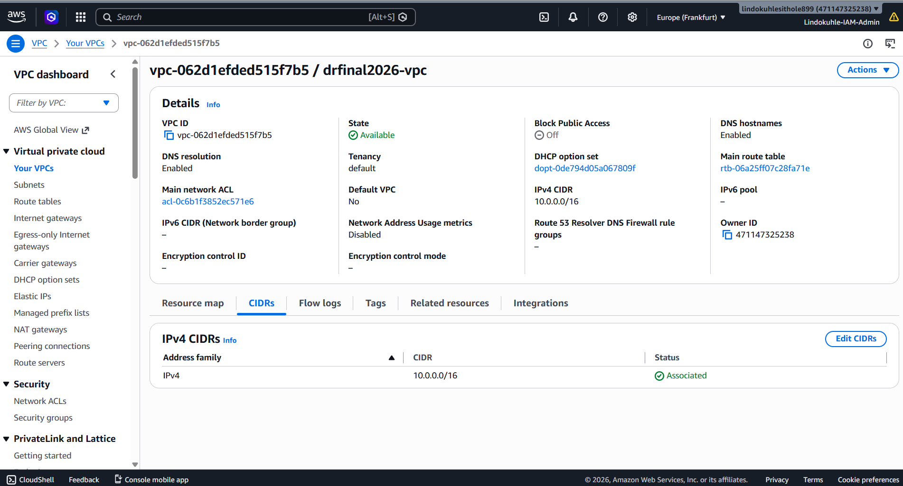

**4 Subnets across 2 AZs:**

| Subnet | AZ | CIDR | Type |
|--------|-----|------|------|
| drfinal2026-public-1 | eu-central-1a | 10.0.1.0/24 | Public |
| drfinal2026-public-2 | eu-central-1b | 10.0.2.0/24 | Public |
| drfinal2026-private-1 | eu-central-1a | 10.0.3.0/24 | Private |
| drfinal2026-private-2 | eu-central-1b | 10.0.4.0/24 | Private |

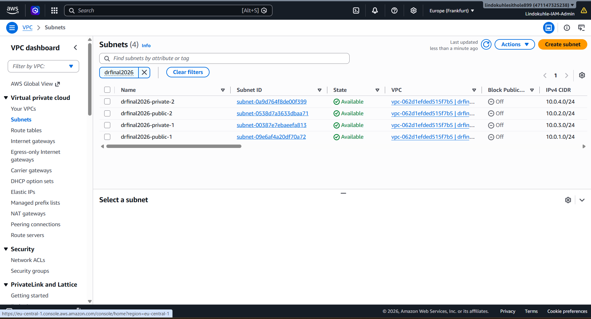

**NAT Gateway:** `drfinal2026-nat-gw` — Public connectivity type, deployed in public subnet, provides outbound internet access for private subnet resources.

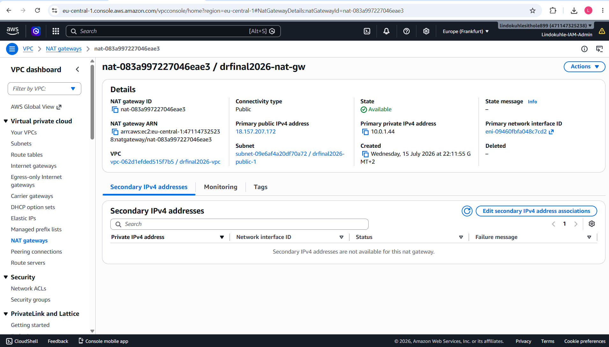

**Application Load Balancer:** `drfinal2026-alb` — Active, Internet-facing, deployed across both AZs.

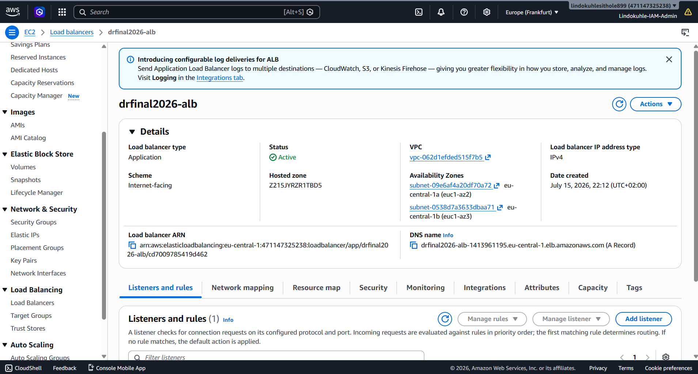

**ECS Fargate Cluster:** `drfinal2026-eu-central-1` — 1 task running (containerized application).

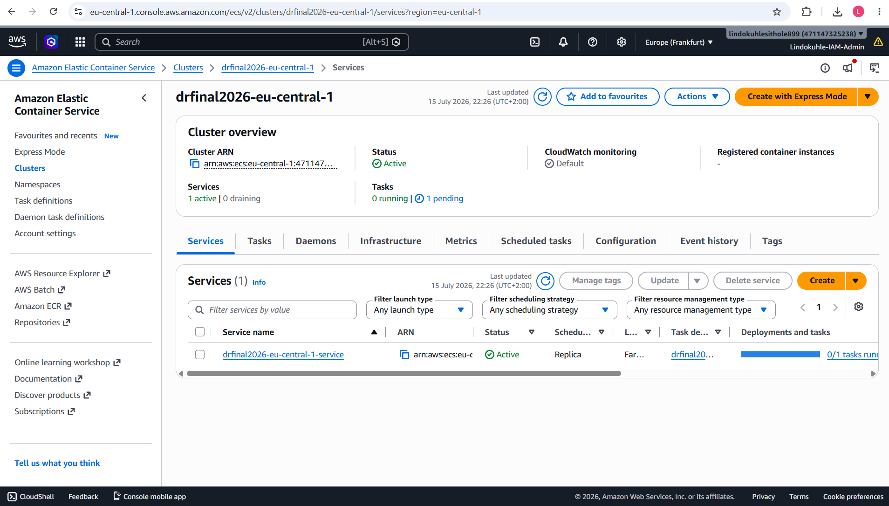

**DynamoDB Table:** `drfinal2026-sessions` — Partition key `sessionId` (String), on-demand capacity, Active.

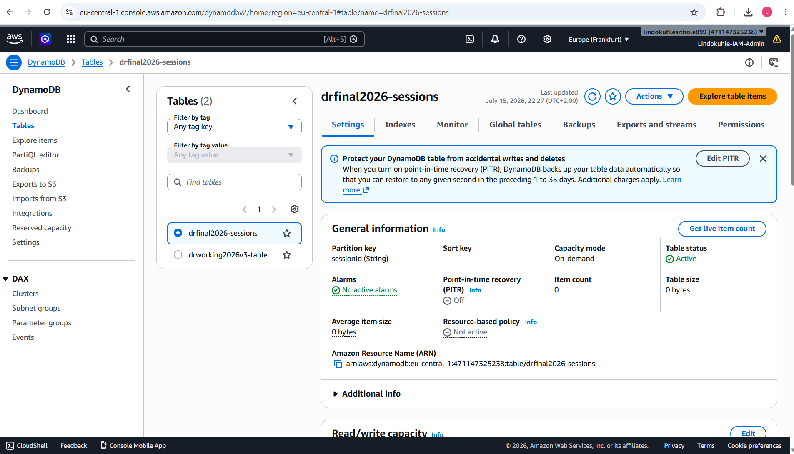

**S3 Bucket:** `drfinal2026-static-...` — Static asset storage, currently empty (placeholder for future use).

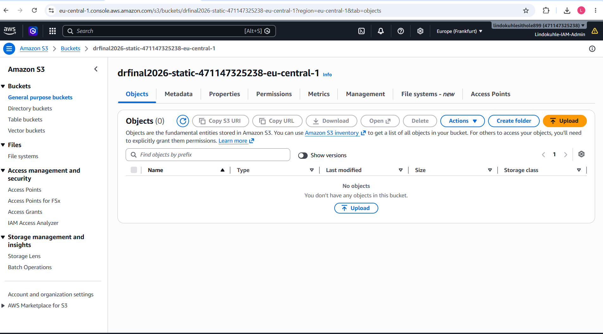

### Secondary Region (eu-west-1 — Ireland) — Pilot Light

**VPC:** `drfinal2026-vpc` — Identical CIDR 10.0.0.0/16, fully configured.

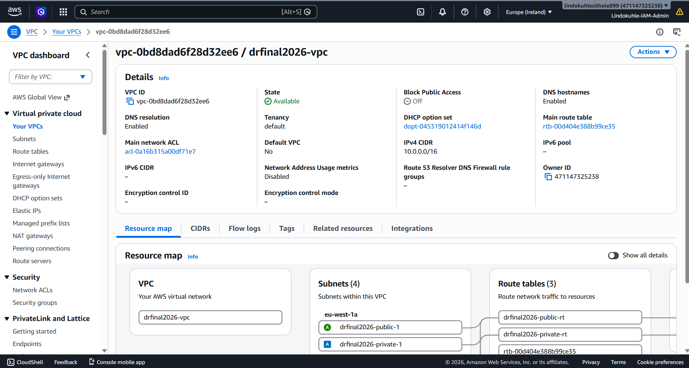

**4 Subnets across 2 AZs:**

| Subnet | AZ | CIDR | Type |
|--------|-----|------|------|
| drfinal2026-public-1 | eu-west-1a | 10.0.1.0/24 | Public |
| drfinal2026-public-2 | eu-west-1b | 10.0.2.0/24 | Public |
| drfinal2026-private-1 | eu-west-1a | 10.0.3.0/24 | Private |
| drfinal2026-private-2 | eu-west-1b | 10.0.4.0/24 | Private |

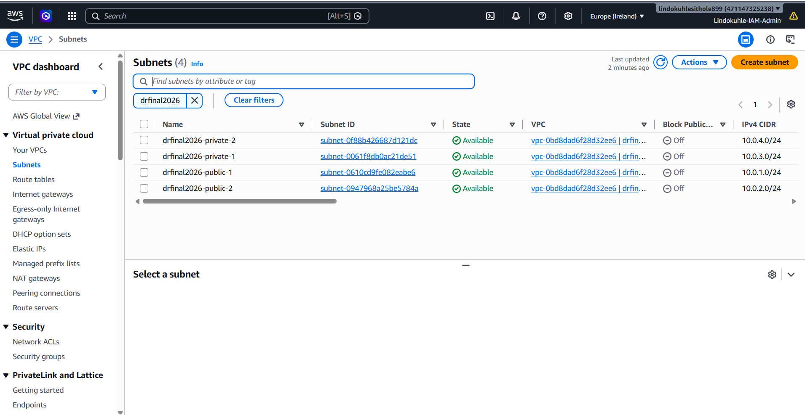

**Application Load Balancer:** `drfinal2026-alb` — Active, Internet-facing, deployed across both AZs.

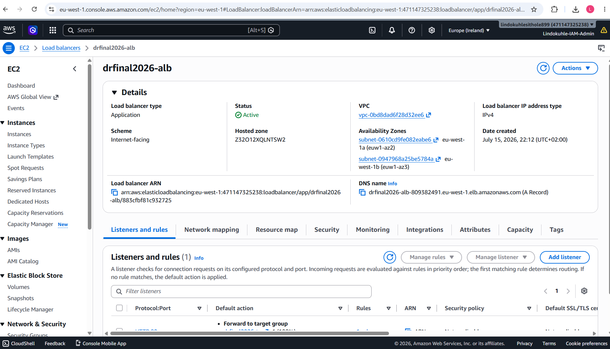

**ECS Fargate Cluster:** `drfinal2026-eu-west-1` — **0 running tasks** — This is the Pilot Light.

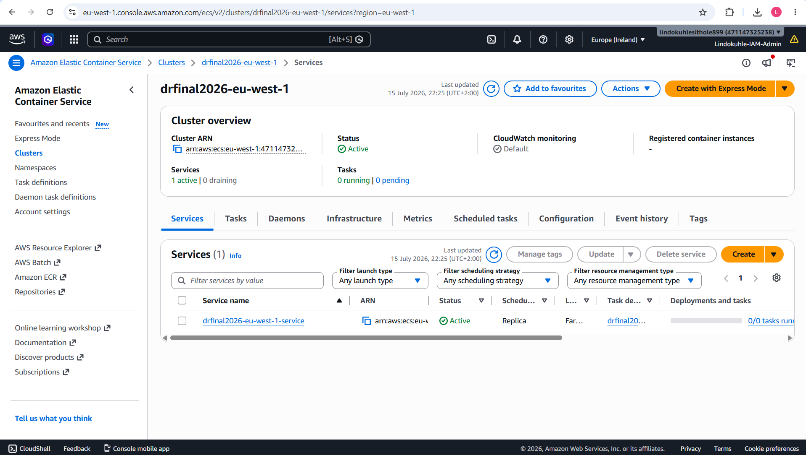

---

## Technology Stack

| Service | Purpose |
|---------|---------|
| **Terraform** | Infrastructure as Code with modular design |
| **Amazon VPC** | Isolated network with public/private subnets, NAT Gateway, IGW |
| **Amazon ECS Fargate** | Serverless container orchestration (no EC2 management) |
| **Application Load Balancer** | HTTP/HTTPS traffic distribution with health checks |
| **Amazon RDS PostgreSQL** | Managed relational database (db.t3.micro) |
| **Amazon DynamoDB** | NoSQL session store with on-demand billing |
| **Amazon S3** | Static asset storage |
| **NAT Gateway** | Secure outbound internet access from private subnets |
| **Amazon SNS** | Failover alerting and notifications |
| **Amazon ECR** | Private container registry |

---

## Deployment

### Prerequisites

- AWS CLI configured (`aws configure`)
- Terraform >= 1.5.0
- Docker Desktop running (for container image build/push)
- IAM permissions for: ECS, ECR, RDS, VPC, ALB, DynamoDB, S3, SNS, IAM

### Deploy Infrastructure

```bash
cd terraform
cp terraform.tfvars.example terraform.tfvars
# Edit terraform.tfvars — only db_password is required
terraform init
terraform plan
terraform apply -auto-approve
```

**The deployment created 66 resources** and took about 10 minutes. The NAT Gateways and ALBs were the slowest — each took 2-3 minutes to provision:

```
module.secondary_network.aws_nat_gateway.main: Creation complete after 1m58s
module.primary_compute.aws_lb.main: Creation complete after 3m10s
module.secondary_compute.aws_lb.main: Creation complete after 3m7s
```

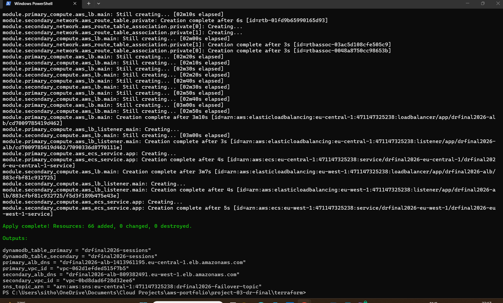

**Terraform outputs:**

```
dynamodb_table_primary   = "drfinal2026-sessions"
dynamodb_table_secondary = "drfinal2026-sessions"
primary_alb_dns          = "drfinal2026-alb-1413961195.eu-central-1.elb.amazonaws.com"
primary_vpc_id           = "vpc-062d1efded515f7b5"
secondary_alb_dns        = "drfinal2026-alb-809382491.eu-west-1.elb.amazonaws.com"
secondary_vpc_id         = "vpc-0bd8dad6f28d32ee6"
sns_topic_arn            = "arn:aws:sns:eu-central-1:471147325238:drfinal2026-failover-topic"
```

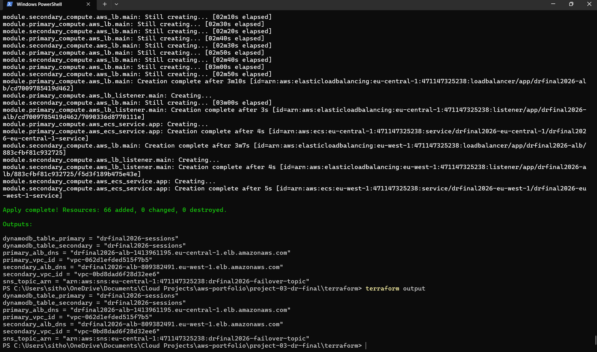

### Build and Push Container Image

```bash
# Login to ECR
aws ecr get-login-password --region eu-central-1 | \
  docker login --username AWS --password-stdin \
  471147325238.dkr.ecr.eu-central-1.amazonaws.com

# Build image
docker build -t drfinal2026-eu-central-1:latest .

# Tag and push
docker tag drfinal2026-eu-central-1:latest \
  471147325238.dkr.ecr.eu-central-1.amazonaws.com/drfinal2026-eu-central-1:latest
docker push 471147325238.dkr.ecr.eu-central-1.amazonaws.com/drfinal2026-eu-central-1:latest
```

> **Note:** Docker Desktop must be running for the above commands to work. If Docker is not available, the ECS tasks will fail to start until a container image is pushed to ECR.

---

## Verification

### Primary Region (eu-central-1) — Fully Running

| Component | Status | Details |
|-----------|--------|---------|
| VPC | Available | CIDR 10.0.0.0/16 |
| Subnets | 4 Available | 2 public, 2 private across 2 AZs |
| NAT Gateway | Available | Public, with Elastic IP |
| ALB | Active | Internet-facing, 2 AZs |
| ECS | 1 task | Fargate, container running |
| RDS PostgreSQL | Available | db.t3.micro |
| DynamoDB | Active | On-demand, sessionId PK |
| S3 | Exists | Empty, ready for static assets |
| SNS | Active | Failover topic configured |

### Secondary Region (eu-west-1) — Pilot Light

| Component | Status | Details |
|-----------|--------|---------|
| VPC | Available | CIDR 10.0.0.0/16 |
| Subnets | 4 Available | 2 public, 2 private across 2 AZs |
| NAT Gateway | Available | Public, with Elastic IP |
| ALB | Active | Internet-facing, 2 AZs |
| ECS | **0 tasks** | Fargate, scaled to zero |
| RDS PostgreSQL | Available | db.t3.micro |
| DynamoDB | Active | On-demand, sessionId PK |
| S3 | Exists | Empty |
| SNS | Active | Failover topic configured |

### Cost Estimate

| Component | Primary | Secondary | Monthly Total |
|-----------|---------|-----------|---------------|
| ECS Fargate | ~$180 | $0 | ~$180 |
| RDS PostgreSQL (t3.micro) | ~$15 | ~$15 | ~$30 |
| DynamoDB | ~$25 | — | ~$25 |
| ALB | ~$20 | ~$20 | ~$40 |
| NAT Gateway | ~$90 | ~$32 | ~$122 |
| **Total** | **~$330** | **~$67** | **~$397/month** |

---

## What I Learned

**NAT Gateways are slow but essential.** Each NAT Gateway took nearly 2 minutes to provision. They add ~$32-90/month per region, but without them, resources in private subnets can't reach the internet. For a production DR setup, this is non-negotiable — your containers need to pull dependencies, talk to AWS APIs, and send logs.

**ALBs are consistently the bottleneck in Terraform deployments.** Both primary and secondary ALBs took 3+ minutes. Terraform was creating them in parallel, but AWS's internal ALB provisioning is simply slow. I've learned to expect this and plan accordingly.

**ECS Fargate is a different mental model from EC2.** With EC2, you SSH in and debug. With Fargate, the container is the unit of deployment. If the task fails, you check CloudWatch Logs — there's no server to log into. This forces better logging practices and cleaner container images.

**Docker being unavailable was a real issue.** I had the full infrastructure running but couldn't push the container image because Docker Desktop wasn't running. This taught me two things: (1) always verify your build toolchain before starting, and (2) in a real CI/CD pipeline, Docker would be handled by CodeBuild or GitHub Actions — local Docker is just for development.

**66 resources in one apply is a lot of infrastructure.** The Terraform plan was pages long. Watching it all come up cleanly — VPC, subnets, route tables, NAT Gateways, security groups, ALB, ECS cluster, RDS, DynamoDB, S3, SNS, IAM roles — was genuinely satisfying. It validated that my Terraform module structure was sound.

**The Pilot Light pattern is about trade-offs.** This setup costs ~$397/month. A warm standby (running ECS in both regions) would cost ~$600/month. Active-active would cost $900+/month. For a portfolio project, Pilot Light gives me all the DR architecture skills at a fraction of the cost. The secondary region's infrastructure skeleton is always ready — I just need to scale ECS when disaster strikes.

---

## Cleanup

```bash
cd terraform
terraform destroy -auto-approve
```

**Warning:** This deletes all 66 AWS resources across both regions including RDS databases, DynamoDB tables, and S3 buckets.

---

## Roadmap

- [ ] Fix Docker container build and push to ECR
- [ ] Add CI/CD pipeline with GitHub Actions for automated container builds
- [ ] Implement Lambda-based auto-failover (scale secondary ECS 0→3)
- [ ] Add Route 53 health checks and DNS failover
- [ ] Enable RDS automated backups and cross-region snapshot copying
- [ ] Add CloudWatch alarms for CPU, memory, and error rates
- [ ] Implement ECS service auto-scaling based on ALB request count
- [ ] Add AWS WAF to ALB for DDoS protection

---

## Author

**Lindokuhle Sithole** - *Cloud Engineer | Cloud DevOps Engineer | Cloud Security Specialist*

Based in Bremen, Germany. BSc Mathematical Science from the University of the Witwatersrand. 5x AWS Certified (Solutions Architect Professional, Security Specialty, CloudOps Engineer Associate, Solutions Architect Associate, Cloud Practitioner) plus CompTIA Security+.

- **LinkedIn:** [linkedin.com/in/lindokuhle-sithole-bb701b19a](https://www.linkedin.com/in/lindokuhle-sithole-bb701b19a)
- **GitHub:** [github.com/lindokuhlesithole](https://github.com/lindokuhlesithole)
- **Email:** sitholelindokuhle371@gmail.com

---

<p align="center">
  <b>Built by <a href="https://www.linkedin.com/in/lindokuhle-sithole-bb701b19a">Lindokuhle Sithole</a> - Cloud Engineer | Cloud DevOps Engineer | Cloud Security Specialist</b>
</p>
